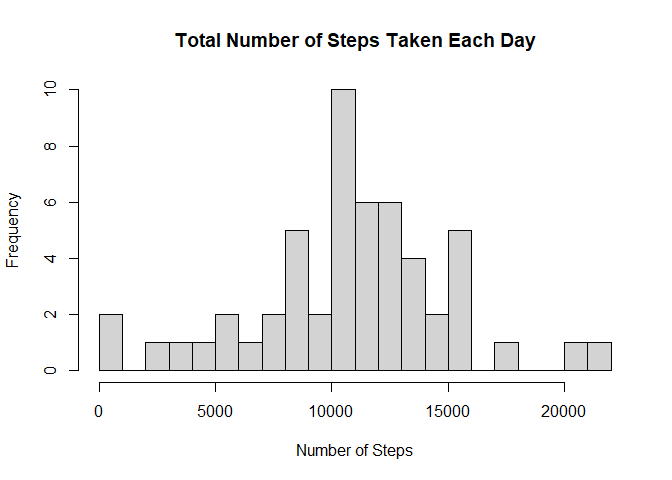
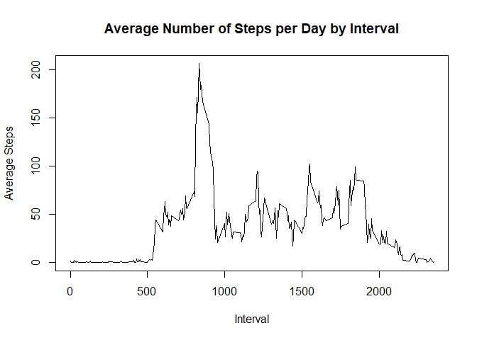
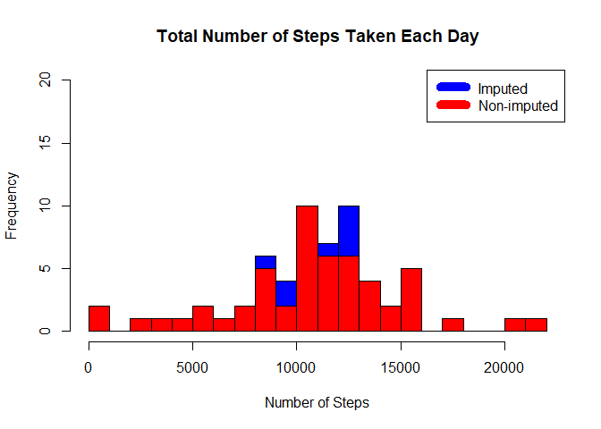
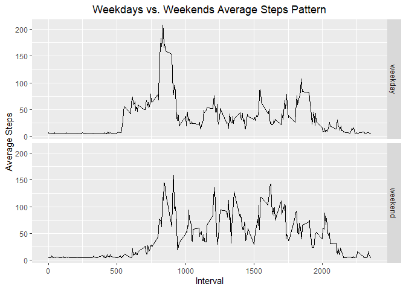

## Loading and preprocessing the data

```r
if(!file.exists("activity.csv")) {
        unzip("activity.zip")
}

full_data <- read.csv("activity.csv", header = TRUE)
```

## 1. What is mean total number of steps taken per day?

### Histogram of the total number of steps taken each day

```r
steps_each_day <- aggregate(steps ~ date, full_data, sum)
hist(steps_each_day$steps, breaks = 20,
     main = paste("Total Number of Steps Taken Each Day")
     , xlab = "Number of Steps")
```

<!-- -->

### Calculate and report the mean and median total number of steps taken per day

```r
mean_steps <- mean(steps_each_day$steps)
median_steps <- median(steps_each_day$steps)

sprintf("Mean of the steps taken each day %.3f", mean_steps)
```

```
## [1] "Mean of the steps taken each day 10766.189"
```

```r
sprintf("Median of the steps taken each day %.3f", median_steps)
```

```
## [1] "Median of the steps taken each day 10765.000"
```


## 2. What is the average daily activity pattern?

```r
## Time series plot of the 5-minute plot and average number of steps taken, averaged across all days
avg_steps_across_all_days <- aggregate(steps ~ interval, full_data, mean)
plot(avg_steps_across_all_days$interval, avg_steps_across_all_days$steps, type = "l", xlab = "Interval"
        , ylab = "Average Steps", main = "Average Number of Steps per Day by Interval")
```

<!-- -->

```r
## Which 5-minute interval, on average across all the days in the dataset, contains the maximum number of steps?
max_step_interval <- avg_steps_across_all_days[which.max(avg_steps_across_all_days$steps),1]
sprintf("Maximum number of steps were taken in interval %d", max_step_interval)
```

```
## [1] "Maximum number of steps were taken in interval 835"
```

# Imputing missing values

## 1. Get the total of number of rows with missing values (NA)

```r
sprintf("Total number of rows with missing values is %d", sum(is.na(full_data)))
```

```
## [1] "Total number of rows with missing values is 2304"
```

### Impute missing values with mean value per column
### Create a new dataset with missing values filled in

```r
library(Hmisc)
```


```r
## Copy full data into a new data set
full_data_imputed <- full_data
full_data_imputed$weekday <- weekdays(as.Date(full_data$date))

## Replacing missing values under steps column with mean of the same column
full_data_imputed$steps <- ave(full_data$steps, full_data_imputed$weekday,FUN=function(x) ifelse(is.na(x), mean(x,na.rm=TRUE),x))
```
The missing value is replaced by the average of the weekday group.


## 4. Make a histogram of the total number of steps. Calculate the mean and median total number of steps taken per day.
### Looking at the impact of imputing. Compare old vs new histogram

```r
steps_each_day_imputed <- aggregate(steps ~ date, full_data_imputed, sum)

hist(steps_each_day_imputed$steps, breaks = 20, col = 'blue' ,main = paste("Total Number of Steps Taken Each Day"), xlab = "Number of Steps", ylim = c(0,20))
hist(steps_each_day$steps, breaks = 20, col = 'red', main = paste("Total Number of Steps Taken Each Day"), xlab = "Number of Steps", add=T)
legend("topright", c("Imputed", "Non-imputed"), col=c("blue", "red"),lwd = 10)
```

<!-- -->

### Looking at the median and mean

```r
mean_steps_imputed <- mean(steps_each_day_imputed$steps)
median_steps_imputed <- median(steps_each_day_imputed$steps)
```
### Making a Comparison Table


```r
comparison_table <- matrix(c(mean_steps, mean_steps_imputed, median_steps, median_steps_imputed), ncol = 2, byrow = TRUE)

colnames(comparison_table) <- c("Original", "Imputed")
rownames(comparison_table) <- c("mean", "median")
```

Looking at the comparison table

```
##        Original  Imputed
## mean   10766.19 10821.21
## median 10765.00 11015.00
```

### Differences between old and new mean / median

```
## [1] "Difference between new and old mean is 55.0209"
```

```
## [1] "Difference between new and old median is 250.0000"
```

# Are there differences in activity patterns between weekdays and weekends?

## Create a new factor with weekday and weekend

```r
full_data_imputed$weekend_factor <- ifelse(weekdays(as.Date(full_data_imputed$date)) %in% c("Saturday", "Sunday"), "weekend", "weekday")
```

## Make a panel plot containing time series separated by weekend and weekday

```r
panel_plot <- aggregate(steps ~ interval + weekend_factor, data = full_data_imputed, mean)
```


```r
library(ggplot2)
ggplot(panel_plot, aes(interval, steps)) + geom_line() + facet_grid(weekend_factor ~ .) + xlab("Interval") + ylab("Average Steps") + ggtitle("Weekdays vs. Weekends Average Steps Pattern") + theme(plot.title = element_text(hjust = 0.5))
```

<!-- -->
